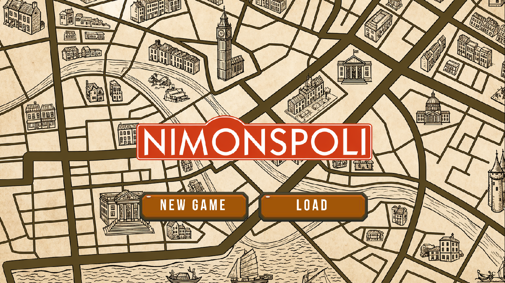

# Nimonspoli — Tugas Besar 1 IF2010 Pemrograman Berorientasi Objek



## Deskripsi Program

**Nimonspoli** adalah implementasi permainan papan bergaya monopoli dalam bahasa
**C++** yang dibangun di atas konsep-konsep **Pemrograman Berorientasi Objek**.
Permainan ini dibuat untuk memenuhi Tugas Besar 1 mata kuliah IF2010 Pemrograman
Berorientasi Objek.

Pemain (2 sampai 4 orang) berkeliling papan permainan dengan 40 petak,
membeli properti, membayar sewa, mengikuti lelang, membangun rumah dan hotel,
membayar pajak, mengambil kartu kesempatan & dana umum, serta menggunakan kartu
kemampuan spesial untuk mencapai objektif menjadi pemain dengan kekayaan
terbanyak ketika permainan berakhir.

Program ditampilkan dalam **GUI** (Graphical User Interface) dengan menggunakan versi grafis SFML 2.x mencakup papan permainan, animasi pion, popup interaktif, panel aset, dan leaderboard.

## Fitur

- **40 petak papan permainan**: 22 petak lahan (dengan 8 color group), 4 petak
  stasiun, 2 petak utilitas (PLN & PAM), 2 petak pajak, 2 petak festival,
  4 petak kartu kesempatan & dana umum, dan 4 petak spesial (GO, Penjara,
  Bebas Parkir, Pergi ke Penjara).
- **Sistem properti lengkap**: pembelian, lelang otomatis, sewa berdasarkan
  bangunan, monopoli color group, gadai/tebus, dan pengambilalihan saat bangkrut.
- **Pembangunan**: rumah (1–4) dan upgrade ke hotel dengan aturan pemerataan
  per color group.
- **Sistem pajak**: PPH (pilih flat atau persentase) dan PBM (flat).
- **Festival**: efek penggandaan sewa hingga 8x dengan durasi 3 giliran.
- **Kartu Kemampuan Spesial**: MoveCard, DiscountCard, ShieldCard, TeleportCard,
  LassoCard, dan DemolitionCard.
- **Penjara**: tiga cara keluar (bayar denda, kartu bebas, lempar dadu double).
- **Save / Load**: menyimpan dan memuat seluruh state permainan ke file teks.
- **Transaction Logger**: mencatat seluruh kejadian penting selama permainan.
- **Antarmuka grafis (GUI)**: papan dinamis dengan animasi pion clockwise,
  popup interaktif, leaderboard real-time, dan panel aset.

## Requirements

| Kebutuhan          | Versi minimal                | Keterangan                       |
| ------------------ | ---------------------------- | -------------------------------- |
| **Sistem Operasi** | Linux / WSL2 (Ubuntu 20.04+) | -                                |
| **Compiler C++**   | g++ ≥ 9.0                    | Mendukung C++17                  |
| **make**           | GNU Make ≥ 4.0               | Untuk build via Makefile         |
| **SFML**           | 2.5.x atau 2.6.x             | Hanya dibutuhkan untuk versi GUI |

## Cara Compile (WSL / Linux)

### 1. Update package list dan install dependencies dasar

```bash
sudo apt update
sudo apt install -y build-essential g++ make
```

### 2. Install SFML

```bash
sudo apt install -y libsfml-dev
```

Verifikasi instalasi SFML:

```bash
dpkg -l | grep libsfml
```

### 3. Pindah ke direktori project

```bash
cd /tugas-besar-1-frp
```

### 4. Compile

```bash
make gui
```

Hasil binary: `bin/game_gui`

#### Membersihkan hasil build

```bash
make clean
```

## Cara Run

```bash
make run-gui
```

atau langsung:

```bash
./bin/game_gui
```

### Alur dasar penggunaan

1. Saat program dijalankan, akan muncul menu utama dengan dua opsi:
   - **New Game**: memulai permainan baru. Anda akan diminta memasukkan
     jumlah pemain (2–4) dan username masing-masing.
   - **Load Game**: memuat state permainan dari file save sebelumnya.
2. Setelah game dimulai, ikuti urutan giliran. Pada gilirannya, pemain dapat
   melempar dadu, membeli/menggadaikan/menebus properti, membangun bangunan,
   menggunakan kartu kemampuan, atau menyimpan permainan.
3. Permainan berakhir saat tercapai batas maksimum giliran (`MAX_TURN` di
   `config/misc.txt`) atau hanya tersisa satu pemain yang tidak bangkrut.

### File konfigurasi

Semua file konfigurasi berada di direktori `config/`:

| File           | Isi                                               |
| -------------- | ------------------------------------------------- |
| `property.txt` | Daftar properti, harga, sewa, dan biaya bangunan  |
| `aksi.txt`     | Pemetaan petak aksi ke papan                      |
| `railroad.txt` | Tabel sewa stasiun berdasarkan jumlah kepemilikan |
| `utility.txt`  | Faktor pengali sewa utilitas                      |
| `tax.txt`      | Konfigurasi PPH (flat & persentase) dan PBM       |
| `special.txt`  | Gaji GO dan denda penjara                         |
| `misc.txt`     | `MAX_TURN` dan saldo awal pemain                  |

Anda dapat mengubah nilai-nilai di file ini untuk kustomisasi.

## Struktur Direktori

```
tugas-besar-1-frp/
├── assets/              # Aset GUI (gambar, font)
├── bin/                 # Binary hasil compile (game, game_gui)
├── build/               # File object & dependency hasil compile
├── config/              # File konfigurasi runtime
├── data/                # File data tambahan (output, board)
├── include/             # Header (.hpp)
│   ├── core/            # Engine, manager, command, dll.
│   ├── models/          # Tile, Property, Player, Card, dll.
│   ├── utils/           # Loader konfigurasi, exception, helper
│   ├── views/           # Header CLI views
│   └── viewsGUI/        # Header GUI views (SFML)
├── src/                 # Source (.cpp), struktur mengikuti include/
│   ├── main.cpp         # Entry point versi CLI
│   └── main_gui.cpp     # Entry point versi GUI
├── test/                # Test cases
├── makefile             # Build script
└── README.md            # Dokumen ini
```

## Anggota Tim

| NIM      | Nama                       |
| -------- | -------------------------- |
| 13524006 | Gabriella Botimada Lubis   |
| 13524032 | Juan Oloando Simanungkalit |
| 13524064 | Stefani Angeline Oroh      |
| 13524093 | Reinsen Silitonga          |
| 13524098 | Reva Natania Sitohang      |

---
